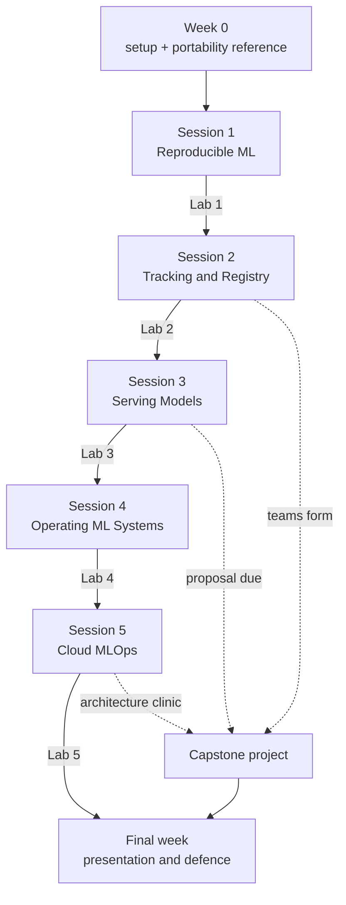

# ITCS355 — Course Materials

Everything a student needs to read, in one place. The code they run lives one level up, in
the repository root.

**ITCS355 Machine Learning Operation and Deployment** · 1(1-0-2) · Faculty of ICT, Mahidol
University · 5 sessions × 3 hours + final week

---

## Read in this order

1. **[`reference/cloud-portability-reference.md`](reference/cloud-portability-reference.md)**
   — before anything else. Defines the contract that makes every lab work on AWS, Azure, or
   GCP, and contains the Week 0 setup checklist.
2. **[`../README.md`](../README.md)** — the repository you will actually work in.
   Deeper detail in [`../docs/REPO-GUIDE.md`](../docs/REPO-GUIDE.md).
3. Your current lab handout, from `labs/`.
4. **[`project/project-brief.md`](project/project-brief.md)** — read it after Session 2, not
   in the final week.




---

## Session map

| Session | Topic | CLO | Handout | Code you touch |
|---|---|---|---|---|
| 1 | From Notebook to Reproducible ML | CLO1 | [Lab 1](labs/lab-01-reproducible-training.md) | `src/train.py`, `Dockerfile`, `tests/test_data.py` |
| 2 | Experiment Tracking and Model Management | CLO1 | [Lab 2](labs/lab-02-tracking-and-registry.md) | `src/tune.py`, `src/costs.py`, `scripts/compare_runs.py` |
| 3 | Serving Models | CLO2, CLO3 | [Lab 3](labs/lab-03-serving-and-rollback.md) | `service/`, `loadtest/` |
| 4 | Operating ML Systems | CLO2, CLO3 | [Lab 4](labs/lab-04-cicd-monitoring-drift.md) | `.github/workflows/`, `monitoring/` |
| 5 | Cloud MLOps | CLO2, CLO3 | [Lab 5](labs/lab-05-cloud-mlops-and-cost.md) | `pipeline/`, `cloudlayer/pipelines.py` |
| Final | Presentations and defence | All | [Project brief](project/project-brief.md) | everything |

---

## Assessment at a glance

| Component | Marks | CLO1 / CLO2 / CLO3 |
|---|---|---|
| Project | 50 | 20 / 16 / 14 |
| Quiz (5 × 5) | 25 | 8 / 8 / 9 |
| Lab completion (5 × 5) | 25 | 10 / 7 / 8 |
| **Total** | **100** | **38 / 31 / 31** |

**There is no final examination.** The project's 50 marks are the five rubric criteria (45)
plus the live demo and defence (5).

**Labs are marked directly**, 5 marks each, against the acceptance criteria in each handout.
A lab either meets them or it does not — there is no partial credit for a service that almost
deploys.

Quizzes still carry evidence questions drawn from your own lab output: your p95 figure, your
run ID, the true cause behind your drift alert. So a copied lab earns nothing in the quiz. The
labs also compound, which means skipping Lab 1 makes Lab 3 impossible.

**Model accuracy is not graded anywhere.** A 0.71 AUC model with clean lineage, a working
rollback, and an honest cost report outscores a 0.94 model that only runs on its author's
laptop.

Full allocation is on the **Assessment Blueprint** sheet —
readable as [`spec/course-specification.md`](spec/course-specification.md), authoritative as
[`spec/Course_Specification_ITCS355_merged.xlsx`](spec/Course_Specification_ITCS355_merged.xlsx).

---

## Contents

```
course/
├── spec/       Faculty course specification. The .xlsx is authoritative; the .md is
│               generated from it by scripts/export_spec_md.py and renders on GitHub.
│               Seven original sheets untouched; four added.
├── slides/     Course overview deck. course-deck.md renders here with diagrams;
│               the .html is a styled presentation version.
├── reference/  The cloud portability contract. Read first.
├── labs/       Five take-home lab handouts.
└── project/    Capstone brief, milestones, and rubric.
```

---

## Cloud platform

The labs are written provider-neutral and work on **AWS, Azure, or GCP**. You pick one in
Week 0 and stay on it. Your choice does not affect your marks: the grader only ever calls
the neutral interface defined in the portability reference.

Target spend for the term is under 800 THB. Every lab ends with a teardown step, and
teardown is checked.
