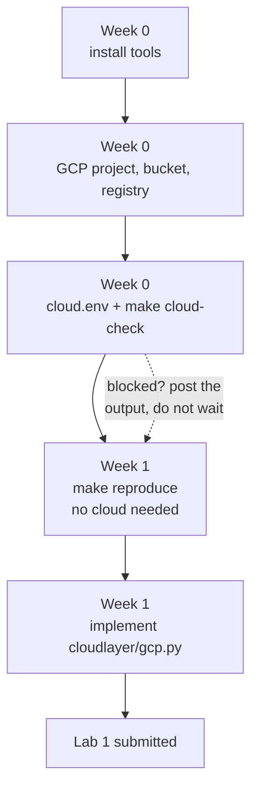

# ITCS355 — Getting Started on GCP (Week 0 and Week 1)

The GCP path through Week 0, from a laptop with nothing installed to a finished Lab 1. Written
for **minimum access** — one project, basic permissions, a small budget.

Its sibling is [`getting-started-azure.md`](getting-started-azure.md) — do **one** of them, not
both, and stay on the provider you pick for the whole term.

## Why you might pick GCP

**The registry is cheaper.** Artifact Registry bills for what you store — half a gigabyte free,
then cents per gigabyte per month — where Azure's Container Registry charges a flat daily rate
whether you push anything or not. For a term of small images that difference is real.

**The catch:** the Google Cloud free trial asks for a credit card to verify identity. It does not
charge it, but if you have no card, or you would rather not put a personal card behind a course
exercise, take the Azure path instead — Azure for Students issues credit from your university
email with no card at all.

**Your university address will not work here.** Google Cloud is not enabled for student accounts
in the university's Workspace tenant, so sign in with a personal Google account. That is a
setting on our side, not something you can fix.

> **Read [`reference/cloud-portability-reference.md`](reference/cloud-portability-reference.md)
> alongside this.** It explains *why* the repository is shaped the way it is. This guide is the
> *how*, in order, with the commands.

**Time:** about 90 minutes for Week 0, about 4 hours for Lab 1.



---

## Before you start

You need four things. If any is missing, fix it before Session 1 — not during it.

| | What | How to check |
|---|---|---|
| 1 | Python 3.11 or newer | `python3 --version` |
| 2 | Docker, running | `docker run hello-world` |
| 3 | Git | `git --version` |
| 4 | A GCP project you can use, with billing attached | see §2 below |

On macOS, Docker Desktop is the simplest option. On Windows, use WSL2 and run every command in
this guide inside the Linux shell, not PowerShell — the Makefile assumes bash.

---

# Week 0

## 1. Install the Google Cloud CLI

```bash
curl https://sdk.cloud.google.com | bash
exec -l $SHELL
gcloud --version
```

macOS with Homebrew: `brew install --cask google-cloud-sdk`.

## 2. Sign in and select your project

```bash
gcloud auth login
gcloud projects list
```

`gcloud projects list` shows what you can actually see. One of these is yours.

```bash
export PROJECT_ID=<the project id from the list>
gcloud config set project $PROJECT_ID
gcloud auth list
```

`gcloud auth list` must print your account with `*` next to it. If it prints nothing, the login
did not complete.

**If `gcloud projects list` is empty**, you have no project yet. Try to create one:

```bash
gcloud projects create itcs355-<studentid>
```

If that fails with a permissions error, you are on a managed or organisation-owned account and
cannot create projects. Ask the instructor for a project in the course organisation — do not
spend an evening fighting it.

**Billing must be attached**, even though Lab 1 costs almost nothing. Without it the storage API
returns `403` and the error does not mention billing. Check in the console under
*Billing → My Projects*. If you cannot attach billing yourself, that is also an instructor
request. Students on the free trial credit are fine.

## 3. Enable the two APIs Lab 1 needs

```bash
gcloud services enable storage.googleapis.com artifactregistry.googleapis.com
```

That is all Lab 1 touches. You will enable Vertex AI later, in Lab 2 — not now.

If this returns `PERMISSION_DENIED`, you are missing `roles/serviceusage.serviceUsageAdmin`. See
§8 for the exact list to ask for.

## 4. Create your bucket and your image repository

Bucket names are **globally unique across all of Google Cloud**, so put your student ID in it.
Use `asia-southeast1` (Singapore) unless you have a reason not to — it is the closest region to
Bangkok and keeps latency numbers in Lab 3 honest.

```bash
export REGION=asia-southeast1
export BUCKET=itcs355-<studentid>

gcloud storage buckets create gs://$BUCKET --location=$REGION --uniform-bucket-level-access

gcloud artifacts repositories create itcs355 \
  --repository-format=docker \
  --location=$REGION \
  --description="ITCS355 course images"
```

Verify both exist:

```bash
gcloud storage ls
gcloud artifacts repositories list --location=$REGION
```

## 5. Two separate logins — this trips up almost everyone

`gcloud auth login` authenticates **you, at the terminal**. It does *not* authenticate **Python
libraries**, and it does *not* authenticate **docker**. Those are three different things.

```bash
# so the google-cloud-storage library can find credentials
gcloud auth application-default login

# so `docker push` is allowed to talk to Artifact Registry
gcloud auth configure-docker $REGION-docker.pkg.dev
```

Skipping the first produces `DefaultCredentialsError` in Lab 1. Skipping the second produces a
`denied: Permission "artifactregistry.repositories.uploadArtifacts" denied` on push. Both look
like broken code and are not.

## 6. Get the repository and write `cloud.env`

```bash
git clone <course-repo-url> && cd <repo>
cp cloud.env.example cloud.env
```

`cloud.env` holds your account identifiers. It is gitignored and **must stay that way** —
committing it is an automatic deduction on the capstone. Fill it in:

```bash
CLOUD_PROVIDER=gcp
PROJECT_ID=itcs355-<studentid>
REGION=asia-southeast1

BLOB_URI=gs://itcs355-<studentid>/itcs355
CONTAINER_REGISTRY=asia-southeast1-docker.pkg.dev/itcs355-<studentid>/itcs355

MLFLOW_TRACKING_URI=sqlite:///mlflow.db

MODEL_REGISTRY_NAME=itcs355-<studentid>
IDENTITY_REF=user:<your-gcloud-account-email>

BUDGET_LIMIT_THB=800
```

Notes on two of these:

- **`CONTAINER_REGISTRY`** is `<region>-docker.pkg.dev/<project>/<repo>`. It is *not* `gcr.io`.
  Container Registry (`gcr.io`) is a different, older service, and typing it out of habit is the
  single most common Lab 1 failure.
- **`IDENTITY_REF`** must not be empty. `make cloud-check` fails any slot that resolves to an
  empty string, and all eight are required. In Lab 1 you are running as yourself, so put the
  account `gcloud auth list` shows. It becomes a real service account in Lab 2.

## 7. Verify

```bash
make setup          # installs pinned dependencies; ends with "environment ok"
make cloud-check    # eight capability slots plus CLI, credentials, docker
```

`make cloud-check` prints `PASS` or `FAIL` per line and exits non-zero if anything failed. You
want every line green:

```
  [PASS] CLOUD_PROVIDER         gcp
  [PASS] PROJECT_ID             itcs355-6xxxxxxx
  [PASS] REGION                 asia-southeast1
  [PASS] BLOB_URI               gs://itcs355-6xxxxxxx/itcs355
  [PASS] CONTAINER_REGISTRY     asia-southeast1-docker.pkg.dev/itcs355-...
  [PASS] MLFLOW_TRACKING_URI    sqlite:///mlflow.db
  [PASS] MODEL_REGISTRY_NAME    itcs355-6xxxxxxx
  [PASS] IDENTITY_REF           user:6xxxxxxx@student.mahidol.ac.th
  [PASS] gcloud on PATH
  [PASS] credentials            identity resolved
  [PASS] docker on PATH
```

**Post this output in the course channel before Session 1.** Blockers get fixed before the
session, not during it. A `FAIL` you posted on Wednesday is a five-minute problem; the same
`FAIL` discovered in the room is a lost session.

## 8. Set a budget alert now, not later

The term target is **under 800 THB**. Lab 1 costs a few baht — object storage and a couple of
image pushes. The expensive mistakes come later, and always from something left running.

Console: *Billing → Budgets & alerts → Create budget*. Set the amount to your limit and alerts
at 50%, 90%, 100%. If you cannot create budgets, ask the instructor to set one on the project.

Every lab ends with a teardown step, and teardown is checked:

```bash
make teardown       # deletes resources labelled course=itcs355
```

## 9. If your access is genuinely minimal

You do not need Owner or Editor. The minimum for Week 0 and Lab 1:

| Role | Why |
|---|---|
| `roles/storage.admin` | create the bucket, read and write objects |
| `roles/artifactregistry.writer` | push images |
| `roles/serviceusage.serviceUsageAdmin` | enable the two APIs (§3) |

If someone else creates the bucket and repository and enables the APIs for you, then
`roles/storage.objectAdmin` on that one bucket plus `roles/artifactregistry.writer` is enough.
Send that table to whoever administers your project.

**None of this blocks Lab 1's graded command.** Read on.

---

# Week 1 — Lab 1

Full handout: [`labs/lab-01-reproducible-training.md`](labs/lab-01-reproducible-training.md).
This section is the order to do it in, not a replacement for reading it.

## The part that needs no cloud at all

This is deliberate, and it is the point of the lab. `make reproduce` runs entirely on your
machine, in Docker, with no credentials. That is exactly why a grader can run it.

```bash
make data        # generate the dataset, deterministically
make test        # data contract and split property tests
make train       # train locally, outside the container
make reproduce   # THE ONE COMMAND — the grader runs this and nothing else
make verify      # compare the produced metric against the claim in README.md
```

`make verify` parses the line `expected test_roc_auc: <value> ± <tolerance>` out of the root
`README.md` and compares it against what you just produced. You must re-measure and update that
line after your final change. Choose the tolerance from the spread you actually observe across
seeds — padding it to hide non-determinism is visible, because the grader compares your tolerance
against the variance in your own tracked runs.

**If you are stuck on GCP access, do this part anyway.** It is most of the lab, and it is the
half that is graded by a script.

### On Apple Silicon

`make image` builds for `linux/amd64` so the image matches CI and the grader. On an M-series Mac
that runs under emulation and is slow — several minutes is normal, not a hang. Let it finish.

## The GCP part

Lab 1 asks you to implement three of the ten adapter methods in
[`cloudlayer/gcp.py`](../cloudlayer/gcp.py): `upload`, `download`, and `push_image`. The other
seven raise `NotImplementedError` until Labs 2 to 5.

```bash
pip install google-cloud-storage
```

The file's docstring carries the specific hints. The rules that matter:

- **Parse `gs://bucket/prefix` inside the adapter, never in `src/`.** `make portability-audit`
  fails the build if `gs://`, `googleapis`, or a GCP SDK import appears in `src/`, `service/`,
  `monitoring/`, or `tests/`. That is Layer 1, and it stays provider-neutral.
- **`push_image` must return the digest reference**, `repo@sha256:...`, not the tag you pushed.
  A tag can be moved to point at different bytes; a digest cannot. During an incident, "which
  code is serving?" has to have one answer.
- **GCP calls them labels, not tags**, and they must be lowercase with no spaces. `cfg.tags(1)`
  already produces values that satisfy that. Do not "improve" them.

Check your work:

```bash
make portability-audit   # no provider strings in Layer 1
make image               # build for linux/amd64
make image-push          # push through YOUR adapter
```

## Common failures, in the order you will hit them

| Symptom | Cause |
|---|---|
| `DefaultCredentialsError` | you skipped `gcloud auth application-default login` (§5) |
| `denied: Permission ... uploadArtifacts denied` | you skipped `gcloud auth configure-docker` (§5) |
| `404` pushing to `gcr.io/...` | wrong service — use `<region>-docker.pkg.dev` (§6) |
| `403` on any storage call, everything else fine | billing is not attached to the project (§2) |
| Bucket create fails, name "already exists" | bucket names are globally unique — add your student ID |
| `make cloud-check` fails on `credentials` | `gcloud auth list` shows no active account |
| `make cloud-check` fails on one slot reading `unset` | every one of the eight slots must be non-empty, `IDENTITY_REF` included |
| Portability audit fails after your adapter works | you put `gs://` parsing in `src/` instead of `cloudlayer/` |
| `make reproduce` works for you, fails for the grader | you depend on something outside the repo — a local file, an env var, a cached model |

That last row is the whole lab. Test it by cloning your own repository into a fresh directory
and running `make reproduce` there, before you submit.

---

## What to have done before Session 2

- [ ] `make cloud-check` all green, output posted in the course channel
- [ ] Budget alert set
- [ ] `make reproduce` works from a **fresh clone**, not just your working directory
- [ ] The `expected test_roc_auc:` line in the root `README.md` re-measured and updated
- [ ] `cloudlayer/gcp.py` implements `upload`, `download`, `push_image`
- [ ] `make portability-audit` passes
- [ ] `cloud.env` is **not** in `git status`

Lab 1 is worth 8 marks, awarded met-or-not-met: `make reproduce` works from a fresh clone on a
machine that is not yours, and the metric matches your claim. There is no partial credit for a
repository that almost reproduces — which sounds harsh and is kinder in practice, because it is
the same unambiguous standard for everyone.
