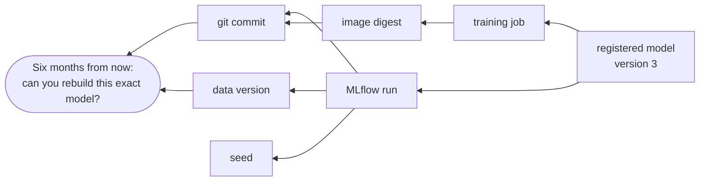

# ITCS355 — Lab 2: Experiment Tracking and Model Registry

**Released:** end of Session 2 · **Due:** before Session 3 · **Effort:** ~4 hours
**CLO1, CLO3** · **Marks:** 8 · **Also assessed through:** Drill 2 and Capstone criterion R1 (Reproducible ML Pipeline)
**Cloud used:** object storage, container registry, managed training, model registry

**In this repository**

Files: `src/tune.py` · `src/costs.py` · `scripts/compare_runs.py` · `scripts/reload_check.py`

Commands: `make tune · make compare · make reload-check`

Every `TODO` marker in those files is a graded decision. Everything around them already works, so you debug your own choices rather than the scaffolding.

---

## Objective

Run a real hyperparameter study under a fixed budget, then register the model you choose with lineage
back to exact code and exact data. The emphasis is on *choose*: this lab grades your justification,
not your metric.

## Before you start

Lab 1 complete and passing. Your image builds and pushes. `make cloud-check` passes.

---

## Task 1 — Move training onto managed compute (60 min)

Implement `submit_training()` and `wait_training()` in your adapter, then run your Lab 1 container as
a managed job rather than locally.

```bash
make train-remote     # adapter.submit_training(image_uri, args) → job_id
```

Your job must read data from `BLOB_URI` and write artifacts back to it. It must not depend on
anything on your laptop.

**Provider notes.** On AWS this is a SageMaker training job; on Azure a command job; on GCP a Vertex
custom training job. All three take the same four things — an image, a command, an instance type, and
an identity — under different parameter names. If your adapter needs more than about 40 lines here,
you are probably fighting the SDK's convenience wrappers; drop to the lower-level client.

**Expect a permissions failure on your first submission.** This is normal on all three providers and
is not a sign you have done something wrong. The job's *submit-time* identity and its *run-time*
identity are different things. Read the error, fix the specific missing permission, and record what
it was — Drill 2 asks.

## Task 2 — Run a budgeted study (75 min)

At least **12 trials**, varying at least three hyperparameters. Use discounted compute (spot,
low-priority, or preemptible) and make your job resumable from a checkpoint so an interruption costs
you minutes rather than the run.

**Budget: 150 THB for this lab.** Track spend as you go, not afterwards.

Log for every trial: all hyperparameters, validation and test metrics separately, wall-clock
duration, instance type, and estimated cost. Cost is a first-class metric in this course — a trial
that is 0.3% better and four times more expensive is not better.

## Task 3 — Compare and justify (45 min)

Produce a comparison of your trials — a table or a plot, exported to `reports/lab2-comparison.*` —
and write a justification of **200 words maximum** for the model you selected.

The justification must address, explicitly:
- why this model rather than the highest-scoring one, if they differ
- the variance across seeds for your chosen configuration
- what it costs to train and what it will cost to retrain monthly
- one way this choice could be wrong

**A justification that only says "highest validation score" scores zero on this task.** If the
highest-scoring model genuinely is the right choice, say why the margin is real and not noise.

## Task 4 — Register the model with lineage (40 min)

Implement `register_model()` and register your chosen model.

The registry entry must carry, as tags or properties:

```
git_commit=<sha>            data_version=<dvc hash>
mlflow_run_id=<id>          training_job_id=<id>
image_digest=<sha256>       seed=<n>
metric_val=<value>          metric_test=<value>
```



Lineage exists to answer that one question. Any missing edge above is a path by which the
answer becomes no.

Then promote it through a staging step. Write in your README who — in a real organisation, not in
this course — should be allowed to perform that promotion, and what evidence they should require.

**Provider notes.** SageMaker Model Registry uses model package groups with approval status; Azure ML
uses named models with versions and stages; Vertex AI uses the Model Registry with aliases. Your
adapter returns a version string in all three cases; the grader only sees the version string.

## Task 5 — Prove you can reload it (20 min)

Write `scripts/reload_check.py` that pulls the registered model *by version, from the registry* — not
from a local file — and scores five held-out rows.

This is the lab's quiet test. Models that cannot be reloaded six months later are the most common
form of dead work in industry, and the cause is almost always a serialization assumption: a custom
class that no longer exists, a library version that moved, a preprocessing step that lived in the
notebook.

---

## Deliverables checklist

- [ ] `submit_training()` and `wait_training()` implemented and working
- [ ] 12+ trials on discounted compute, checkpointed, all tracked
- [ ] Interruption survived and resumed — evidence in logs
- [ ] Comparison artifact in `reports/`
- [ ] 200-word justification covering all four required points
- [ ] Model registered with all eight lineage fields
- [ ] Promotion step performed, with a note on who should own it
- [ ] `reload_check.py` runs from the registry and scores rows
- [ ] Cost recorded per trial, total under 150 THB
- [ ] `make teardown` run

## Acceptance criteria

**Passes when** the registered model traces to exact code and exact data, `reload_check.py` runs
clean from the registry, and the justification addresses something other than the headline metric.

**Fails when** lineage fields are missing or wrong; the study is fewer than 12 trials or varies only
one hyperparameter; the justification is a restatement of the metric; the model cannot be reloaded
from the registry.

## Common failure modes

| Symptom | Cause |
|---|---|
| Job fails immediately with an access error | Run-time identity lacks storage permission — different from your CLI identity |
| Spot interruption loses the whole run | Checkpoint written only at the end |
| `reload_check.py` fails with an unpickling error | A custom class defined in the training script, not importable at load time |
| Registry entry has no lineage | Tags set on the run instead of on the registered version |
| Cost far above estimate | Instance ran while you debugged; the meter does not care that the job was broken |

## Teardown

```bash
make teardown        # deletes jobs and compute tagged lab=2
make cost-report     # confirm actual spend
```

The registered model and its artifacts stay — Lab 3 needs them.

## What Drill 2 covers

Concepts: tracking versus registry, lineage, promotion, serialization risk. Evidence from your own
work: the specific permission that failed on your first submission, your chosen run ID, the seed
variance you measured, and your monthly retraining cost estimate.
