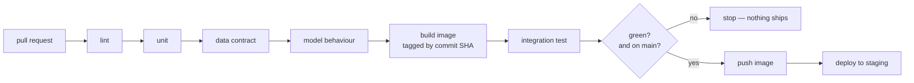
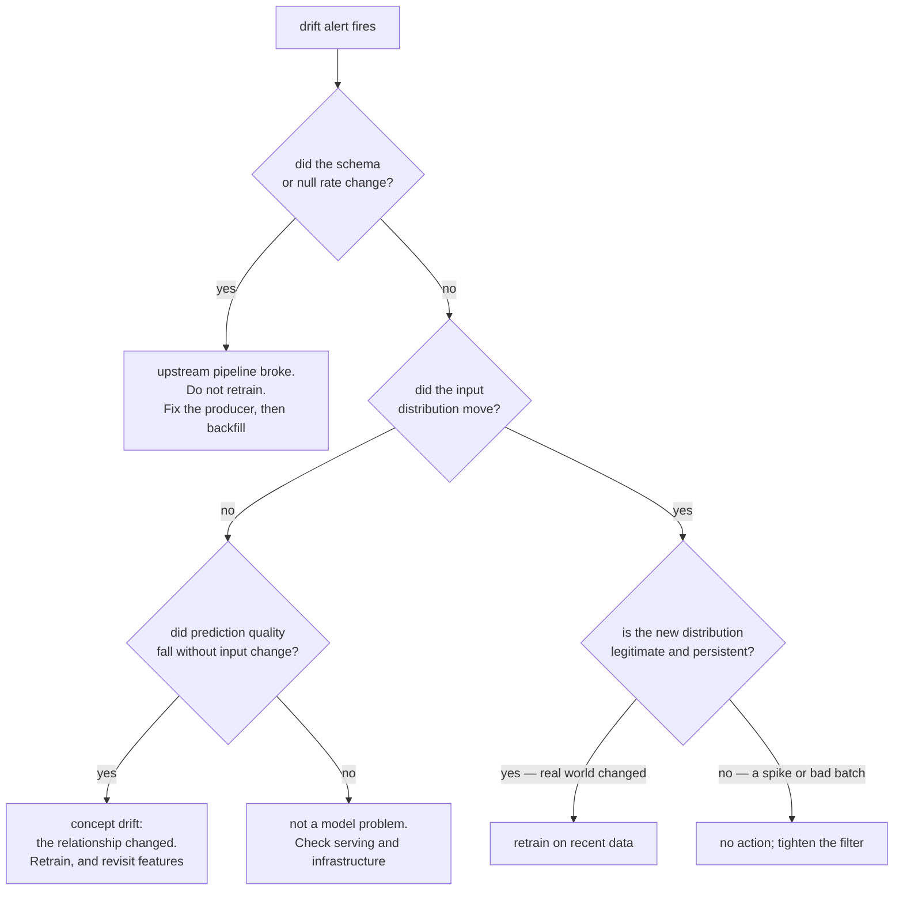

# ITCS355 — Lab 4: CI/CD, Observability, and Drift

**Released:** end of Session 4 · **Due:** before Session 5 · **Effort:** ~5 hours
**CLO2, CLO3** · **Marks:** 8 · **Also assessed through:** Drill 4 and Capstone criteria R3 (Monitoring & Reliability) and R4 (Failure Handling & Technical Defense)
**Cloud used:** container registry, managed endpoint, monitoring, scheduler, secrets

**In this repository**

Files: `.github/workflows/ci.yml` · `.github/workflows/cd.yml` · `monitoring/drift.py` · `monitoring/slo.yaml` · `monitoring/dashboard.json` · `tests/test_model_behaviour.py` · `scripts/inject_drift.py` · `docs/postmortem-template.md`

Commands: `make inject-drift · make drift`

Every `TODO` marker in those files is a graded decision. Everything around them already works, so you debug your own choices rather than the scaffolding.

---

## Objective

Automate the path from commit to deployed model, then instrument the running service so it tells you
when something is wrong — and prove it does, by breaking it on purpose.

---

## Task 1 — Tests that can actually fail (60 min)

Four categories. The point of each is different, and Drill 4 asks you to distinguish them.

**Unit tests** — your preprocessing and feature code. Fast, no network.

**Data contract tests** (at least two) — assertions about the data itself, not the code:
- schema: expected columns present, correct types, no unexpected columns
- range or distribution: a numeric feature within plausible bounds, a categorical within its known set
- null rate below a stated threshold
- the leakage test from Lab 1, still passing

**Model behaviour tests** (at least one) — assertions about what the model does, independent of the
metric. A known input produces a prediction in a known range. A monotonic relationship holds where
the domain says it must. Prediction latency stays under a threshold on a fixed sample.

**Integration test** — build the image, start the container, hit `/predict`, assert on the response
shape and the model version.

Each test must be one that *can fail for a real reason*. A test asserting `True == True` passes CI and
teaches nothing. In your README, name the specific production incident each data contract test would
have caught.

## Task 2 — CI pipeline (50 min)

GitHub Actions, triggered on pull request and on push to main.

```
lint → unit tests → data contract tests → model behaviour tests
     → build image → integration test → push image (main only)
     → deploy to staging (main only)
```



Cheap checks run first, so a schema mistake fails in 30 seconds rather than after a build.

Requirements:
- Secrets come from the repository secret store or your provider's identity federation, never from
  a committed file
- The image is tagged with the commit SHA, not `latest`
- Deploy only runs on green, only on main

**Provider notes.** All three support OIDC federation from GitHub Actions, so you do not need
long-lived keys: `aws-actions/configure-aws-credentials`, `azure/login` with a federated credential,
or `google-github-actions/auth` with workload identity federation. Using OIDC rather than a stored
key is worth doing — it is the modern default and it is asked about in Drill 4.

## Task 3 — Prove a bad commit is blocked (25 min)

Open a pull request that deliberately breaks one data contract — for example, drop a required column
or widen a categorical beyond its allowed set.

Capture: the failing CI run, the specific test that caught it, and the error message. Then close the
pull request without merging.

**This artifact is required.** A green pipeline proves nothing about whether your tests work. The
failing run is the evidence.

## Task 4 — Dashboard (50 min)

Instrument the service and build a dashboard covering, at minimum:

- request rate
- error rate, split by 4xx and 5xx
- latency p50, p95, p99
- **at least one feature-distribution statistic** computed over a rolling window
- current model version in production

Then write an SLO for your service — a target, a measurement window, and what you would do when the
error budget is spent. One sentence each. Most students write a target and stop; the third part is
where the thinking is.

**Provider notes.** CloudWatch, Azure Monitor, and Cloud Monitoring all accept custom metrics through
your adapter's `emit_metric()`. Alternatively run Prometheus and Grafana in containers, which is fully
portable and gives you a dashboard definition you can commit as code. Either is acceptable; committing
the dashboard as code is better and is noted favourably.

## Task 5 — Drift detection on a schedule (50 min)

Implement a drift detector — Evidently, or your own PSI or Kolmogorov–Smirnov implementation — that
compares recent production inputs against your training reference window.

Requirements:
- Runs on a schedule (EventBridge, Azure ML schedule, or Cloud Scheduler)
- Writes a drift score as a metric
- Fires an alert to a real channel you will actually see — email, Slack, or Line Notify
- Has a stated threshold, and a stated reason for that threshold

A threshold picked because it is the library default is not a stated reason.

## Task 6 — The injected drift exercise (40 min)

Deliberately shift one feature's distribution in your input stream. Scale it, shift its mean, or
change the mix of a categorical.

Capture:
1. The alert firing, with a timestamp
2. The dashboard showing the shift
3. How long it took from injection to alert

Then write a **five-line post-mortem**:

```
What fired:
True cause:
Retrain, roll back, or no action — and why:
What this would have cost if unnoticed for a week:
How to prevent or detect it faster:
```

The third and fourth lines are where the marks are. "Retrain" is not automatically correct — if the
cause is a broken upstream pipeline, retraining on corrupted data makes things permanently worse.



**Retraining on corrupted data destroys your last good model faster than any schedule
would.** That left branch is the one roughly half of every cohort gets wrong.

---

## Deliverables checklist

- [ ] Unit tests, 2+ data contract tests, 1+ model behaviour test, 1 integration test
- [ ] README naming the incident each data contract test would have caught
- [ ] CI pipeline running the full sequence, secrets via OIDC or a secret store
- [ ] Images tagged by commit SHA
- [ ] CD to staging on green, main only
- [ ] **Evidence of the blocked bad commit** — failing run and the test that caught it
- [ ] Dashboard with the five required signals
- [ ] SLO: target, window, and error-budget response
- [ ] Scheduled drift detector with a justified threshold, alerting to a real channel
- [ ] Injected drift: alert evidence, timestamps, detection time
- [ ] Five-line post-mortem
- [ ] `make teardown` run

## Acceptance criteria

**Passes when** the deliberately bad commit is blocked by a named test, and the injected drift fires a
real alert with a post-mortem whose reasoning holds up.

**Fails when** no failing CI run is shown; the drift detector has never fired; the post-mortem
recommends retraining without considering that the cause might be upstream breakage.

## Common failure modes

| Symptom | Cause |
|---|---|
| Drift detector never fires | Threshold copied from a tutorial and far too loose for your feature |
| Everything alerts constantly | Window too short; you are detecting normal variance |
| CI passes but deploy fails | CI identity has build permission but not deploy permission |
| Cannot reproduce the CI failure locally | Test depends on ordering or on a fixture only present in CI |
| Dashboard shows nothing | Metrics emitted to a different namespace than the dashboard queries |

## Teardown

```bash
make teardown
make cost-report
```

Scheduled jobs are the ones people forget — a schedule that survives teardown will keep invoking your
deleted endpoint and generating errors, or worse, keep a container warm. Check the scheduler
explicitly.

## What Drill 4 covers

Concepts: the four test categories and what each protects against, continuous training triggers, SLOs
and error budgets, distinguishing data drift from concept drift from pipeline breakage. Evidence from
your own work: which test caught your bad commit, your drift threshold and why, your detection time,
and your post-mortem's retrain-or-rollback decision.
