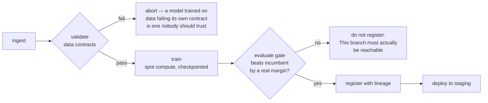

# ITCS355 — Lab 5: Cloud MLOps, Portability, and Cost

**Released:** end of Session 5 · **Due:** before final week · **Effort:** ~5 hours
**CLO2, CLO3** · **Marks:** 5 · **Also assessed through:** Quiz 5 and Project criterion R5
**Cloud used:** all eight capability slots

**In this repository**

Files: `pipeline/pipeline.yaml` · `cloudlayer/pipelines.py` · `scripts/evaluation_gate.py` · `scripts/cost_report.py` · `scripts/portability_swap_check.py` · `scripts/teardown_verify.py`

Commands: `make pipeline · make cost · make swap-check · make teardown`

Every `TODO` marker in those files is a graded decision. Everything around them already works, so you debug your own choices rather than the scaffolding.

---

## Objective

Consolidate your service onto managed cloud MLOps components, prove that the portability contract you
have been following actually holds, and account honestly for what the whole thing costs.

This is the lab where the three-layer discipline from Lab 1 either pays off or does not.

---

## Task 1 — Managed pipeline (70 min)

Replace your manual sequence with a managed pipeline that runs the full path in one triggered
execution:

```
ingest → validate (data contract tests) → train → evaluate
       → register (only if the evaluation gate passes) → deploy to staging
```



A pipeline that always registers has no gate. The grader will try to make yours fail.

The evaluation gate must be a real condition — a metric threshold, or a comparison against the
currently registered production model. A pipeline that always registers is not a gate.

**Provider notes.** SageMaker Pipelines, Azure ML Pipelines, and Vertex AI Pipelines all express this
as a DAG of containerised steps. Vertex uses Kubeflow Pipelines definitions; Azure uses YAML
components; SageMaker uses a Python SDK that builds a JSON definition. Your steps are the same
containers in all three cases — that is the point. Keep step logic in your image, not in the
pipeline definition.

## Task 2 — Least privilege, properly (45 min)

Replace whatever broad permissions you have been using with scoped identities. At minimum, separate:

- the **training** identity — read data, write artifacts and metrics
- the **serving** identity — read the model artifact, write logs and metrics
- the **CI** identity — push images, trigger the pipeline, deploy

Document each in a table: identity, what it can do, and why each permission is needed. Then test the
scoping by removing one permission you believe is unnecessary and confirming what breaks.

**That last step is the assessed part.** Anyone can write a permissions table. Finding out what
actually breaks is how you learn where the boundaries are, and it is what Quiz 5 asks about.

## Task 3 — Scheduled retraining (40 min)

Schedule the pipeline. Then answer, in your README, the question that matters: **what should trigger
a retrain?**

Compare three strategies for *your* system:

| Strategy | When it is right | How it fails |
|---|---|---|
| Fixed schedule | | |
| Data volume threshold | | |
| Drift-triggered | | |

Fill the table for your specific problem, not in general. Then state which you chose and what the
worst case looks like — including the scenario where drift-triggered retraining on corrupted upstream
data destroys a working model faster than any schedule would.

## Task 4 — The portability test (60 min)

This is the core of the lab and the reason the course is structured the way it is.

**Part A — audit.** Prove your Layer 1 code is clean:

```bash
make portability-audit
# greps src/ for provider strings; must return zero matches
# confirms every external reference resolves through cloud.env
```

Any hit is a leak. Fix it by moving the reference into the adapter.

**Part B — swap.** Implement **three methods only** of a *second* provider's adapter: `upload`,
`download`, and `invoke`. Point `cloud.env` at that provider and demonstrate that your service can
read its data and be called through the second adapter.

You are not migrating the whole system — that would take days. You are proving the seam is real.

**Part C — write it up.** Half a page:
- which of the three methods was hardest, and why
- one place where the abstraction genuinely leaked and could not be hidden
- what a full migration would actually cost in engineering days
- whether the abstraction was worth building, honestly

**A well-argued "no, this abstraction was not worth it" scores full marks.** Portability has a real
price and pretending otherwise is worse engineering than choosing lock-in deliberately.

## Task 5 — Full cost accounting (45 min)

Produce `reports/lab5-cost.md` covering:

1. **Estimate before running** — your prediction, made in advance and committed before Task 1
2. **Actual** — pulled from billing, filtered by your tags
3. **The gap** — a paragraph on why. There is always a gap; explaining it scores, hiding it does not
4. **Breakdown by component** — training, storage, serving, pipeline, monitoring
5. **Cost per 1,000 predictions** at three utilisation assumptions: 5%, 25%, 80%
6. **One optimisation you actually applied**, with the before and after figures

For item 6, the usual candidates: right-size the serving instance, move to a scale-to-zero service,
batch where latency allows, cache repeated inputs, use discounted compute for training, shorten log
retention.

## Task 6 — Teardown, verified (20 min)

```bash
make teardown
make cost-report        # run again 24 hours later
```

Then confirm in the provider console, by hand, that nothing remains: endpoints, pipelines, scheduled
jobs, compute instances, and the schedule itself.

**Submit a screenshot of the empty resource list.** Teardown scripts fail silently, and the bill is
what eventually tells you — usually too late.

---

## Deliverables checklist

- [ ] Managed pipeline running the full path with a real evaluation gate
- [ ] Three scoped identities, documented, with evidence of what broke when you removed a permission
- [ ] Scheduled retraining plus the three-strategy comparison filled in for your system
- [ ] `make portability-audit` returning zero provider strings in `src/`
- [ ] Second provider's `upload`, `download`, and `invoke` implemented and demonstrated
- [ ] Half-page portability write-up including an honest verdict
- [ ] `reports/lab5-cost.md` with all six sections
- [ ] One applied optimisation with before and after figures
- [ ] Teardown verified, screenshot submitted
- [ ] Total term spend under 800 THB

## Acceptance criteria

**Passes when** the pipeline runs end to end with a working gate, the portability audit is clean, the
second adapter demonstrably works, nothing is left running, and your cost figure matches billing
within 20%.

**Fails when** the pipeline registers unconditionally; provider strings remain in `src/`; the second
adapter is written but never demonstrated; resources are still running at grading time.

## Common failure modes

| Symptom | Cause |
|---|---|
| Pipeline step fails only when scheduled, not when run manually | Scheduled execution uses a different identity than your interactive session |
| Portability audit clean but the swap fails | Provider assumptions hidden in config files rather than in `src/` |
| Second adapter's `invoke` returns a different response shape | Each provider wraps prediction responses differently — this is a genuine leak, and worth writing about |
| Cost report far from billing | Untagged resources; tag from creation, not retrospectively |
| Teardown reports success, resources remain | Deletion is asynchronous — re-check after 24 hours |

## What Quiz 5 will ask

Concepts: managed pipeline anatomy, least privilege and identity propagation, retraining trigger
strategies, cost drivers in ML serving, and where cloud abstractions leak. Evidence from your own
work: which permission you removed and what broke, which adapter method was hardest to port, your
cost gap and its cause, and the optimisation you applied with its measured effect.
