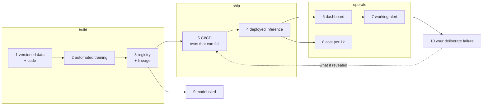

# ITCS355 — Capstone Project Brief

**45 marks · Teams of 2–3 · Proposal end of Session 3 · Presented final week · Repository due +7 days**

Lab handouts are in [`../labs/`](../labs/); this brief covers the capstone only. Read
[`../reference/cloud-portability-reference.md`](../reference/cloud-portability-reference.md)
first — the project inherits the same three-layer contract, and `make portability-audit`
applies here too.

**Teams:** 2–3 · **Proposal:** end of Session 3 · **Presented:** final week ·
**Repository due:** 7 days after final week

## Brief

Ship one machine learning service end to end. Any problem and dataset you can defend, subject to
proposal approval. The grade is on the operational system — **model accuracy carries no marks.**

Good projects are boringly scoped and operationally complete. A demand forecaster with a real CI
pipeline, working alerts, and an honest cost report beats an ambitious multi-model system that only
runs when its author is holding it.

## Required components

Versioned data and code · automated reproducible training · registered model with lineage ·
deployed inference, online or batch · CI/CD with tests that can actually fail · monitoring dashboard ·
at least one working alert · documented cost per 1,000 predictions · a one-page model card ·
and **one deliberate failure you designed for and can demonstrate.**

The dotted edge is the one that separates a good project from a complete one: a failure you
engineered, observed, and then fed back into your tests.

## Milestones

| Stage | Due | What |
|---|---|---|
| M1 | End of Session 2 | Team formed, problem area chosen |
| M2 | End of Session 3 | One-page proposal — approval required before you build |
| M3 | Session 5 | Architecture review, 15-minute clinic slot |
| M4 | Final week | Presentation: 8 minutes plus 5 minutes of questions — **15 marks** |
| M5 | +7 days | Final repository submission — **30 marks** |

**Proposal contents:** problem and who would use it · dataset and its licence · latency and freshness
requirements · the serving pattern you chose and why · your planned failure mode · rough cost
estimate · who on the team owns what.

## Presentation

The problem in 60 seconds, the architecture, a live demo, the failure you engineered and what it
revealed, your costs, and what another week would buy. Do not spend time on model selection — nobody
is grading it. Expect the instructor to send unexpected input during your demo; handling it
gracefully scores, and crashing scores partial credit if your logging makes the cause obvious within
a minute.

## Marking

The capstone is scored on two lines of the course specification, 45 marks together.

**Capstone System — 30 marks.** Five rubric criteria at 6 marks each:

| | Criterion | Evidenced mainly by |
|---|---|---|
| R1 | Reproducible ML Pipeline | Labs 1 and 2 |
| R2 | Deployment & CI/CD | Lab 3 |
| R3 | Monitoring & Reliability | Lab 4 |
| R4 | Failure Handling & Technical Defense | Lab 4, and your deliberate failure |
| R5 | Documentation & Presentation | Lab 5 cost report, model card, README |

Full descriptors are on the Rubric Scoring sheet of the course specification.

**Capstone demo & defense — 15 marks.** The live demo and the questions that follow it, scored
separately from the repository. Preparing the system well and presenting it badly costs a third
of the capstone.

**Automatic deductions:** credentials or API keys committed to the repository · cloud resources left
running after submission · a README that assumes anything not in the repo.

## Suggested directions

Demand or energy forecasting with scheduled batch scoring · real-time fraud or anomaly scoring under
a latency SLO · an image classification endpoint autoscaling under bursty load · a retrieval-augmented
assistant over a document set with an evaluation harness and a cost ceiling · a log anomaly detector
that pages on unusual patterns.
