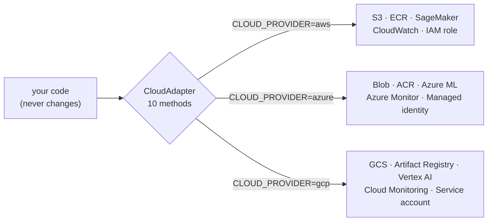

# ITCS355 — Cloud Portability Reference

Read this before Lab 1. Every lab in this course is written against the contract defined here, so
the same handout works whether you are on AWS, Azure, or GCP. You pick one provider in Week 0 and
stay on it for the term.

---

## 1. The three-layer rule

**Layer 1 — provider-neutral core.** Identical for everyone: Python, Docker, DVC, MLflow, FastAPI,
pytest, GitHub Actions, Evidently, and a load generator (k6 or Locust). Roughly 80% of every lab
lives here. If you find yourself writing provider-specific code in Layer 1, you have made a mistake.

**Layer 2 — the environment contract.** Your code never hardcodes a bucket name, a registry host, or
an endpoint URL. It reads them from `cloud.env`. Nothing in `src/` may contain the strings `s3://`,
`abfss://`, `gs://`, `amazonaws`, `azure`, or `googleapis`.

**Layer 3 — one adapter.** A single small module implementing a fixed interface against your
provider's SDK. You write one of these; the course supplies stubs for all three.

Everything you are graded on is checked through Layer 1 and Layer 2. The grader never calls your
provider's SDK directly, which is exactly why your choice of cloud does not affect your marks.




Switching providers means changing one line in `cloud.env` and having written the adapter on
the other side. Lab 5 makes you prove that claim rather than assume it.

---

## 2. The environment contract

Create `cloud.env` at the repository root. Commit `cloud.env.example` with the keys and empty
values; **never commit `cloud.env` itself** — it goes in `.gitignore` on day one.

```bash
CLOUD_PROVIDER=aws            # aws | azure | gcp
PROJECT_ID=itcs355-<studentid>
REGION=<your nearest region>

BLOB_URI=                     # root URI for data and artifacts
CONTAINER_REGISTRY=           # registry host/path for pushing images
MLFLOW_TRACKING_URI=          # tracking server (see §5)

TRAINING_TARGET=              # managed training resource identifier
MODEL_REGISTRY_NAME=          # registry namespace
ENDPOINT_NAME=itcs355-<studentid>-predict

METRICS_NAMESPACE=itcs355
SECRET_STORE_PATH=            # where the app reads credentials at runtime
IDENTITY_REF=                 # role / managed identity / service account

BUDGET_LIMIT_THB=800
```

Verify it with the supplied check before starting any lab:

```bash
make cloud-check     # resolves all eight capability slots, prints PASS/FAIL per slot
```

---

## 3. The adapter interface

`cloudlayer/base.py` is given to you. You implement exactly one of `aws.py`, `azure.py`, or `gcp.py`.

```python
class CloudAdapter(ABC):
    def upload(self, local_path: str, key: str) -> str: ...
    def download(self, uri: str, local_path: str) -> None: ...
    def push_image(self, local_tag: str) -> str: ...
    def submit_training(self, image_uri: str, args: dict) -> str: ...
    def wait_training(self, job_id: str) -> dict: ...
    def register_model(self, model_uri: str, name: str) -> str: ...
    def deploy(self, model_ref: str, endpoint: str, instance: str) -> str: ...
    def invoke(self, endpoint: str, payload: dict) -> dict: ...
    def emit_metric(self, name: str, value: float, unit: str) -> None: ...
    def generate(self, prompt: str, params: dict) -> dict: ...
    def teardown(self, tags: dict) -> list[str]: ...
```

Eleven methods. `submit_training` and `deploy` will take you the longest; the rest are thin
wrappers. `generate` returns the text **and** the provider's own token counts — Lab 5 prices a token
bill from them, and an estimated count is a fabricated one.

**Why you are made to write this.** Every managed ML platform sells you the same eleven operations
under different names. Writing the adapter once makes that visible, and it is the difference between
knowing a product and knowing the category. In Session 5 we compare adapters across the room.

---

## 4. Capability mapping

| Capability | AWS | Azure | GCP |
|---|---|---|---|
| CLI | `aws` | `az` | `gcloud` |
| Identity check | `aws sts get-caller-identity` | `az account show` | `gcloud auth list` |
| Object storage | S3 | Blob Storage (ADLS Gen2) | Cloud Storage |
| URI scheme | `s3://` | `abfss://` / `https://<acct>.blob.core.windows.net` | `gs://` |
| Container registry | ECR | Azure Container Registry | Artifact Registry |
| Managed training | SageMaker Training Job | Azure ML command job | Vertex AI Custom Training |
| Model registry | SageMaker Model Registry | Azure ML Model Registry | Vertex AI Model Registry |
| Online endpoint | SageMaker Real-Time Endpoint | Azure ML Managed Online Endpoint | Vertex AI Endpoint |
| Batch inference | SageMaker Batch Transform | Azure ML Batch Endpoint | Vertex AI Batch Prediction |
| Managed LLM endpoint | Bedrock | Azure OpenAI / AI Foundry | Vertex AI generative models |
| Serverless container | App Runner / Fargate / Lambda | Container Apps | Cloud Run |
| Pipelines | SageMaker Pipelines | Azure ML Pipelines | Vertex AI Pipelines |
| Metrics | CloudWatch Metrics | Azure Monitor | Cloud Monitoring |
| Logs | CloudWatch Logs | Log Analytics | Cloud Logging |
| Secrets | Secrets Manager / SSM Parameter Store | Key Vault | Secret Manager |
| Runtime identity | IAM role | Managed identity | Service account |
| Scheduler | EventBridge Scheduler | Azure ML schedules / Logic Apps | Cloud Scheduler |
| Budget alert | AWS Budgets | Cost Management budget | Billing budget |
| Discount compute | Spot instances | Low-priority / spot VMs | Spot VMs |
| Resource grouping | Tags | Resource group + tags | Labels |

A cell being filled does not mean the three are equivalent in behaviour. Cold start, quota, and
scaling behaviour differ enough to matter in Lab 3, and noticing where the abstraction leaks is part
of what Lab 3 assesses.

---

## 5. Tracking server — one recommended setup

MLflow is the neutral choice and each provider offers a managed variant. Unless you have a reason
otherwise, **self-host MLflow in a container backed by your object store**: identical across all
three providers, cheap, and it keeps your tracking data portable if you change your mind.

```bash
MLFLOW_TRACKING_URI=http://localhost:5000
# artifact root points at Layer 2:
mlflow server --backend-store-uri sqlite:///mlflow.db \
              --default-artifact-root ${BLOB_URI}/mlruns
```

Managed alternatives, if you prefer: SageMaker managed MLflow (AWS), Azure ML's native MLflow-
compatible tracking (Azure — the smoothest of the three), Vertex AI Experiments (GCP, different API).
Choosing managed is allowed but you must note the trade-off in your Lab 2 README.

---

## 6. Tag everything, from the first resource

Every resource you create in this course carries these three tags (labels on GCP):

```
course=itcs355   student=<studentid>   lab=<n>
```

This is not bureaucracy. It is how `make teardown` finds things to delete, how you attribute cost per
lab, and how the instructor identifies orphaned resources. A resource created without tags is a
resource you will forget.

---

## 7. Cost control — set this up before Lab 1

Target for the whole term: **under 800 THB per student.** Free tiers plus discounted compute make this
comfortable, provided nothing is left running.

| | AWS | Azure | GCP |
|---|---|---|---|
| Budget | AWS Budgets, alert at 50/80/100% | Cost Management budget with action group | Billing budget with Pub/Sub alert |
| Biggest risk | Idle real-time endpoint | Idle managed online endpoint | Idle Vertex endpoint |
| Cheapest serving | App Runner or small Fargate task | Container Apps (scales to zero) | Cloud Run (scales to zero) |
| Free-tier training | t3/t4g small instances | Low-priority VMs | Spot VMs |

**The single most expensive mistake in this course** is leaving a real-time endpoint running over a
weekend. All three providers bill these per hour whether or not a request arrives. Every lab ends
with a teardown step, and teardown is checked.

```bash
make teardown        # deletes everything tagged course=itcs355,student=<id>,lab=<n>
make cost-report     # pulls actual billing for those tags
```

---

## 8. Week 0 setup

```bash
python --version                 # 3.11+
docker run hello-world
git --version
<aws|az|gcloud> --version
<identity check from §4>         # must return your account, not an error

git clone <course-repo> && cd itcs355
cp cloud.env.example cloud.env   # fill it in
make setup                       # ends with: environment ok
make cloud-check                 # eight slots, all PASS
```

Post your `make cloud-check` output in the course channel before Session 1. Blockers get fixed
before the session, not during it.

---

## 9. Where the abstraction genuinely leaks

Be aware of these; they show up in the labs and are fair game in the in-class drills.

- **Cold start.** Scale-to-zero services (Cloud Run, Container Apps) have startup latency that a
  provisioned endpoint does not. This will dominate your p99 in Lab 3 if you choose one.
- **Quota.** GPU and endpoint quotas default to zero on new accounts across all three providers.
  Request them in Week 0, not the night before Lab 5.
- **Registry authentication.** Docker login expires on different schedules per provider. A push that
  worked yesterday failing today is almost always this.
- **Model packaging.** Each platform expects a slightly different container contract for serving
  (health-check path, port, request shape). Your adapter absorbs this; your `Dockerfile` should not.
- **Identity propagation.** The permission a job needs at submit time differs from the permission it
  needs at run time. This is the most common first failure on all three providers, and Session 5
  spends time on it deliberately.
