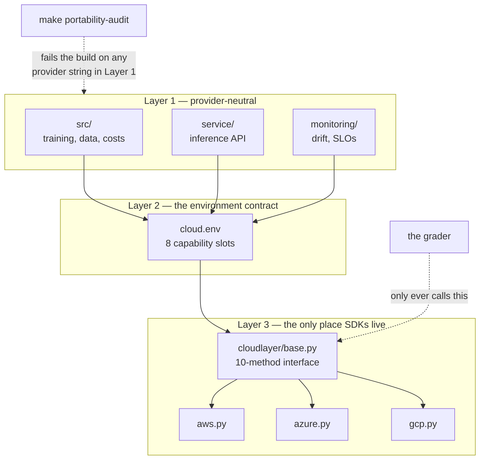

# ITCS355 — Course Repository (v1)

One repository, five labs, one system. You fork this once in Week 0 and it grows across the
term; the capstone is an extension of what you have built, not a separate effort.

Everything is in this one repository: the faculty specification, the slide deck, all five
lab handouts, the project brief, and the code you run. This file explains how the pieces fit
together and what belongs to which lab.

```
course/       what you read      spec, slides, lab handouts, project brief
docs/         how to run it      repo guide, website setup, post-mortem template
src/          Layer 1            provider-neutral training code
service/      Layer 1            inference service
monitoring/   Layer 1            drift, SLOs, dashboard
cloudlayer/   Layer 3            the only place a provider SDK may be imported
pipeline/                        the neutral DAG for Lab 5
instructor/                      grading scripts and marking notes — DELETE before distributing
```

---

## The three-layer rule

Everything here follows one structural rule, and Lab 5 grades whether you kept it.

```
Layer 1   src/  service/  monitoring/     provider-neutral. No SDKs. No bucket names.
Layer 2   cloud.env                       every external reference, by name
Layer 3   cloudlayer/                     the ONLY place a provider SDK may be imported
```

`make portability-audit` enforces it. It scans `src/`, `service/`, `monitoring/`, and
`tests/` for provider hostnames, URI schemes, SDK imports, and absolute developer paths,
and fails the build on any hit.



This is why your choice of cloud does not affect your marks.

This is why your choice of AWS, Azure, or GCP does not affect your marks: the grader only
ever calls the neutral interface.

---

## What each lab adds

| Lab | Adds | Key command |
|---|---|---|
| 1 | `src/train.py`, `Dockerfile`, `tests/test_data.py`, DVC | `make reproduce` |
| 2 | `src/tune.py`, `src/costs.py`, `scripts/compare_runs.py`, `scripts/reload_check.py` | `make tune && make compare` |
| 3 | `service/`, `loadtest/`, `tests/test_service.py` | `make serve`, `make loadtest` |
| 4 | `.github/workflows/`, `monitoring/`, `tests/test_model_behaviour.py` | `make inject-drift && make drift` |
| 5 | `pipeline/`, `cloudlayer/pipelines.py`, cost and teardown scripts | `make pipeline`, `make cost` |

Nothing is thrown away between labs. Lab 3 serves the model Lab 2 registered; Lab 4
monitors the endpoint Lab 3 deployed; Lab 5 moves all of it onto managed infrastructure.

---

## Quick start

```bash
cp cloud.env.example cloud.env      # fill in; never commit
make setup
make cloud-check                    # eight slots must PASS
make data
make test                           # 22 tests
make portability-audit
make reproduce                      # the one command a grader runs
```

---

## The TODOs are the coursework

Every `TODO(Lab n)` marker is a graded decision, not missing scaffolding. Everything around
them works, so you debug your own choices rather than someone else's boilerplate.

| Lab | What you must decide |
|---|---|
| 1 | Hash-pinned requirements · digest-pinned base image · adapter upload/download/push · which pin you would drop first |
| 2 | Search space · verified instance prices · which model to register and why |
| 3 | Your p95 target, set before measuring · provider route mapping · utilisation assumption |
| 4 | Drift threshold and its justification · SLO error-budget response · OIDC block for your provider |
| 5 | Gate margins · retraining trigger · whether the portability abstraction was worth building |

---

## Adapter progress

You implement one provider. Ten methods, spread across the labs so you never write ahead of
what you need.

```
Lab 1   upload, download, push_image
Lab 2   submit_training, wait_training, register_model
Lab 3   deploy, invoke
Lab 4   emit_metric
Lab 5   teardown, and three methods of a SECOND provider (portability proof)
```

---

## Costs

Target for the term: under 800 THB. Free tiers plus discounted compute make this
comfortable, provided nothing is left running.

Every lab ends with `make teardown`, and teardown is checked. The single most expensive
mistake in this course is leaving a real-time endpoint running over a weekend — all three
providers bill those per hour whether or not a request ever arrives.

Every resource carries `course=itcs355`, `student=<id>`, `lab=<n>`. That is how teardown
finds things and how cost is attributed per lab. An untagged resource is one you will
forget, and it will keep billing.

---

## Two things that will catch you out

**MLflow 3.x rejects file-based tracking stores.** `file:./mlruns` raises rather than
working, which is why the default here is `sqlite:///mlflow.db`. If you see a maintenance-
mode exception, this is why.

**A fixed seed reproduces; a changed seed does not.** At seed 20260101 the reference run
returns `test_roc_auc` 0.8482 every time, on any machine. Sweeping seeds 1–5 moves it across
0.82–0.87, because the seed moves the *split*, not just the model. Your stated tolerance
covers the first kind of variation, never the second — and padding it to hide the difference
is visible to the grader.

---

## Instructor material

`instructor/` holds the teaching guide, grading scripts, and marking notes. **Remove it
before distributing the repository to students** — `RUBRIC-labs-2-to-5.md` tells them
exactly which judgement items carry the marks.

```bash
git rm -r --cached instructor/ && echo "instructor/" >> .gitignore
```

`course/spec/Course_Specification_ITCS355_merged.xlsx` contains a **Merge Notes** sheet
listing open decisions and every change made to the faculty template. Delete that sheet
before submitting the workbook to the faculty; keep it while the course is being finalised.

---

## Publishing

See [`WEBSITE.md`](WEBSITE.md). Short version: push to GitHub and send students
`course/README.md`. GitHub renders Mermaid natively in repository view, so there is nothing
to build. GitHub **Pages** needs the fix in `_layouts/default.html`, because Jekyll does not
render Mermaid on its own.

Two files are generated — regenerate, do not hand-edit:

```bash
python scripts/export_spec_md.py         # workbook → course/spec/course-specification.md
node   scripts/site/validate-mermaid.mjs # every diagram must parse
python scripts/site/check_links.py       # every relative link must resolve
```

CI runs all three on every push to a Markdown file.
